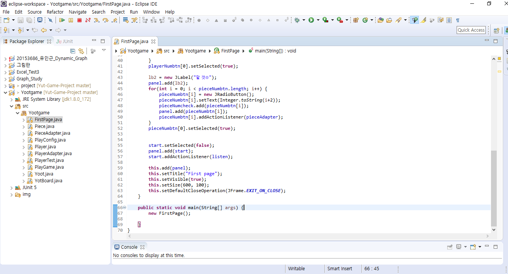
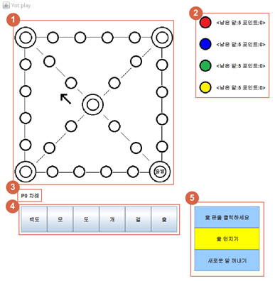

# Yot_noree 윷놀이
***
#### 이 프로그램은 한국의 전통 놀이인 윷놀이를 컴퓨터에서 즐길 수 있는 Java(JDK 1.8.0) 프로그램입니다.
***
1. 게임 규칙은 윷놀이와 동일합니다.    
2. 초기 first page 에서 게임 참여 하는 사람의 명 수와 말의 갯수를 입력 해야 실행 가능합니다.
***

## 프로젝트 소개
   객체지향 분석 및 설계(OOAD)를 통해 윷놀이 게임 개발   

- **윷놀이 규칙**   
1. n번 플레이어가 윷을 던집니다. 
2. n번 플레이어가 움직일 말을 선택합니다. 
3. n번 플레이어가 윷을 던진 결과에 따라 말을 움직입니다.(윷, 모, 상대편 말을 잡았다면 다시 한번 윷을 던집니다.)  
4. n번 플레이어의 턴을 종료하고 n+1 플레이어로 넘어갑니다. 
5. 윷놀이 도중 플레이어의 말이 전부 도착지점에 들어왔다면 그 플레이어의 승리로 윷놀이를 끝냅니다. 
   

## 빌드
   
프로젝트 파일을 다운 받거나 jar 파일을 실행한다.
   
## 게임 시작
   
사용자 수와 게임에 사용할 말의 개수를 설정한다.

## 실행 화면
   
   
① 윷판: 출발(도착)점, 교차점은 이중 원으로 표현해서 가독성을 높여주었다. 화살표는 중앙 교차점에서 빽도가 나왔을 경우 가게 될 방향을 나타내준다.   
   
② 플레이어 정보: 플레이어 말의 색을 다르게 하여 플레이어를 구분해준다. 말 오른쪽에 플레이어의 남은 말과 점수를 숫자로 나타내준다.   
   
③	상태 메시지: 누구의 차례인지와 같은 현재 상태 정보를 나타내준다.   
   
④ 지정 윷 던지기 버튼   
   
⑤ 플레이어가 할 수 있는 행동과 관련된 버튼: 누를 수 있는 버튼을 노란색으로 표현해서 플레이어가 해당 버튼을 누를 수 있도록 유도한다. 만약 노란색 버튼을 누르지 않았다면 상태메시지 창에 "잘못 눌렀습니다", "다시 누르세요" 등의 안내 메세지를 나타내서 눌러야 하는 버튼을 다시 누를 수 있도록 한다.   
   
## 비고
- 사용 언어 : JAVA swing